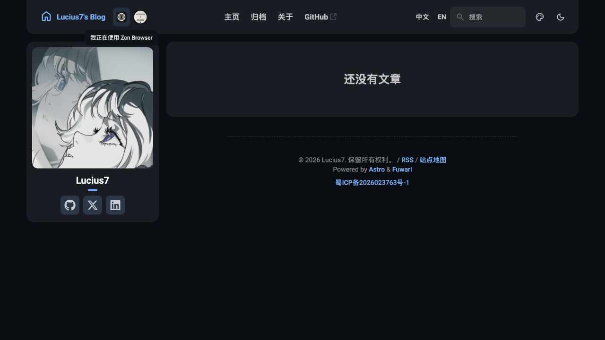
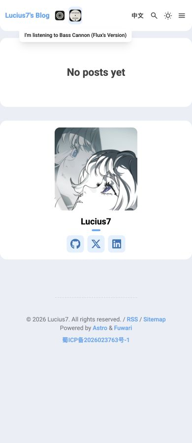

# MacFlare title activity

The top navigation displays the foreground application's icon immediately to the right of the blog title, followed by the currently playing track's cover. The profile sidebar has no activity card. Hover, keyboard focus or a tap reveals the Chinese tooltip `我正在使用 <app>` or `我正在听 <track>`; the English interface uses `I'm using <app>` and `I'm listening to <track>`. Escape or clicking elsewhere closes the tooltip. Only `music.state: "playing"` displays a music icon; paused, stopped or unavailable music is hidden, even when the API retains its last track and artwork.

Configure the widget in `src/config.ts`:

```ts
export const macFlareConfig: MacFlareConfig = {
  enable: true,
  baseUrl: "https://macflare.lucius7.dev",
};
```

Set `enable: false` to remove it. The browser reads the public API after hydration; builds and GitHub Pages do not need credentials, a proxy, or a scheduled rebuild. Never put the MacFlare ingestion token in blog configuration.

## Requests and freshness

- One `GET /api/now` supplies music and the foreground app from the same snapshot. It is polled every 120 seconds while the tab is visible, with a 12-second request timeout. Returning to the tab requests fresh data immediately.
- A local expiry check clears displayed activity at `expires_at`, including during a failed or paused refresh. Offline, failed or invalid responses also clear the icons. Loading and empty states do not add text or placeholders to the navigation.
- Buffered MacFlare snapshots are delayed upstream. The navigation shows activity icons without a delay label.
- `GET /api/icons` is loaded once per component mount and may use its one-hour HTTP cache. It does not read KV. Names and aliases are matched after Unicode and whitespace normalization. The static catalog lacks cross-origin JSON access, so it is not fetched by the blog.
- Application images use `/app-icons/<id>.png` on the configured host. For recognized Apple Music CDN thumbnails, the browser requests a 64×64 JPEG at quality 60 for the 24–28px icon. The sampled 100px cover decreased from 4,963 to 2,396 bytes (about 52%); savings vary by image. Signed, unknown and already-small URLs stay unchanged. This CDN optimization is best-effort: a failed compact image retries the original API URL before using a generic music icon. Failed or unknown app icons also use a generic icon, preserving the tooltip text.

The widget does not render running-app lists, battery information or system metrics. It is excluded from Pagefind. Same-language Swup navigation preserves the single navigation subscription; switching language reloads the translated component. Unmounting cancels its requests, timers and visibility listener.

## Validation

```sh
pnpm test:macflare
pnpm lint
pnpm check
pnpm build
pnpm preview
```

Check `/zh/` and `/en/`, including mobile widths. Use an isolated preview fixture for playing, paused, missing artwork, expired and unavailable states; never push synthetic snapshots to the public MacFlare service or publish test articles.

References: [MacFlare integration guide](https://macflare.lucius7.dev/integrations), [API contract](https://macflare.lucius7.dev/api), [application icons](https://macflare.lucius7.dev/app-icons).

## Preview

These screenshots use an isolated local playing-state fixture to demonstrate the title icons and tooltips. They do not represent the current public activity.




